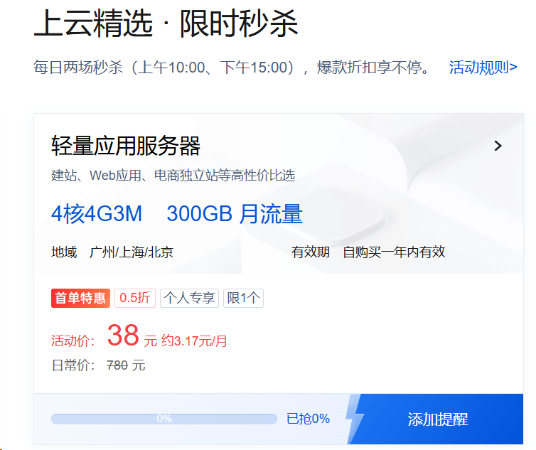

# 腾讯云服务器抢购助手

一键抢购腾讯云活动页 **「上云精选·限时秒杀」** 的轻量应用服务器（38元/年 4核4G3M），支持地域选择、无窗口抢购、浏览器存活监测。



活动页：https://cloud.tencent.com/act/pro/featured-202607#MS

> **免责声明**：本工具仅供个人学习使用。自动化抢购可能违反腾讯云活动规则，可能导致账号限流/受限，风险由使用者自行承担；请勿高频滥用。

## 文件说明

| 文件 | 用途 |
|------|------|
| `腾讯云服务器抢购助手.bat` | **一键启动**（双击运行，无需装任何东西） |
| `seckill_ui.py` | 控制台助手（菜单：选地域 / 扫码登录 / 抢购 / 测试连通） |
| `seckill.py` | 抢购核心逻辑（自动对时、提前3秒开抢、并发调用） |
| `requirements.txt` | 依赖清单（playwright / colorama / requests） |
| `.state.json` | 登录态（扫码登录后自动保存，可复用；**删除需重新扫码**） |
| `config.json` | 配置（当前服务器地域，菜单里修改） |

## 安装依赖（首次）

需 Python 3.10+：

```bash
pip install -r requirements.txt
python -m playwright install chromium
```

## 使用方法

1. **双击 `腾讯云服务器抢购助手.bat`**
2. 首次使用选 `[2] 扫码登录`（弹出浏览器 → 点右上角登录 → 微信扫码 → 自动保存）；直接选 `[3]`/`[4]` 也会自动引导登录
3. 选 `[1]` 切换服务器地域（上海/北京/广州）
4. 选 `[3] 开始抢购`（自动等最近场次 10:00 / 15:00，**开抢前 3 秒自动并发**，全程无窗口）
5. 抢到后控制台显示大字 🎉，**1 小时内到腾讯云控制台付款**

> 登录态失效时，[5] 测试连通会提示并询问是否重新扫码登录；[4] 可手动选择 10:00 或 15:00 场次；[6] 测试下单会真实创建订单（慎用，需输入 YES 确认）。

> 抢购场次：每天 10:00 / 15:00（服务器时间）。同一实名账号限购一次（新用户专享价）。

## 手动命令（不用 .bat 时）

```bash
python seckill_ui.py           # 进入菜单
python seckill.py --test       # 测试API（会产生真实测试订单，慎用）
python seckill.py --time 15:00 # 直接指定场次
```

## 技术要点

- **对时**：读取服务器响应头 Date（7 次采样取中位数，精度 ±0.1s），开抢前 3 分钟再校准一次
- **CSRF**：hook 页面 fetch/XHR 自动捕获动态 token
- **提前量**：服务器时间提前 3 秒开始连发（10 并发 × 20ms × 10 秒）
- **登录验证**：使用查询接口（get-vip-info）无害校验，不会误下单
